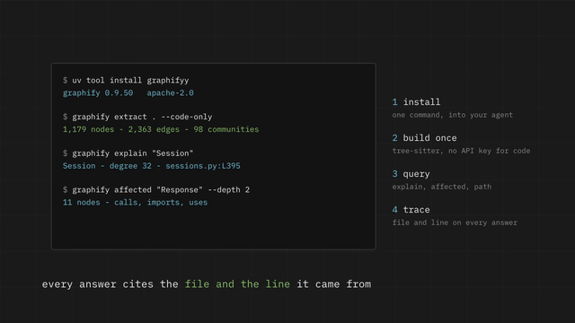
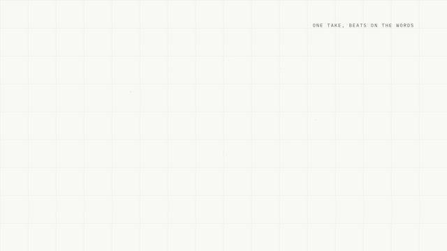
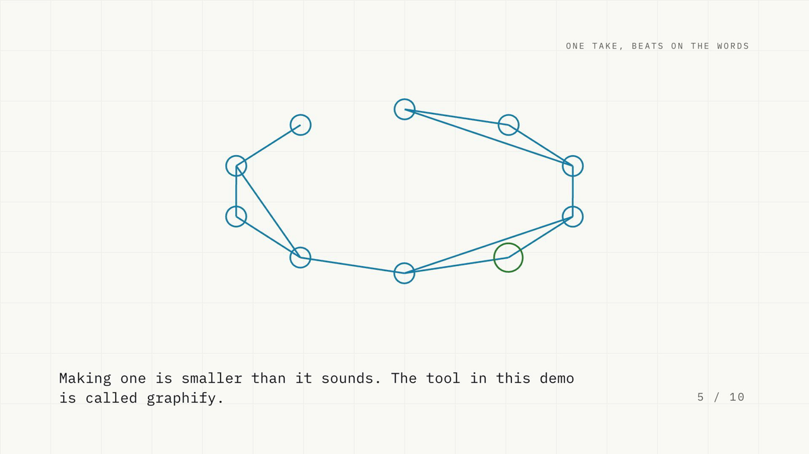

# No AI slop: explainers by narration timing

A method for making short explainer videos where the visuals land on the words, plus the parts of the
toolchain worth reusing. The narration is measured, not estimated, and the finished file is checked before it
ships. Written from building several of these, including the mistakes, because the mistakes are the useful
part.

The narration is the timing source. Record one continuous take, measure where each paragraph starts inside it,
and place every beat on those boundaries. Re-record the voice and the beats move with it.

## The result

Dark, the reference look. 12 seconds from 1:40:



The same piece, same take, on the bright theme. 12 seconds from 1:11, and this one is straight out of the
generator:



3 minutes 8 seconds, ten beats, one continuous take, rendered from the 593 word script in
`examples/knowledge-graph-script.txt` by the tools in this repository. The shapes differ between the clips
because the reference cut draws its bars by hand, while the generator reads a motif out of each paragraph.

[Watch the full cut](https://youtu.be/xZbfV6jDHZ0) · the mp4 and the still frames are in `examples/`.

## Start here

Two ways in. Ask your coding agent, or run the commands yourself. Either way, you bring a key and a script
with one paragraph per beat.

### Ask your agent

```bash
git clone https://github.com/azimshaik/syncframe.git
cd syncframe
```

Then say what you want: "make a 90 second explainer about how a knowledge graph cuts token use". The
repository ships the instructions each tool reads, so the agent runs the pipeline itself.

| Tool | File it reads |
|---|---|
| Claude Code | `CLAUDE.md` |
| Codex, OpenCode, Aider, Droid, Trae, and other `AGENTS.md` tools | `AGENTS.md` |
| Gemini CLI, Antigravity | `GEMINI.md` |
| Cursor | `.cursor/rules/syncframe.mdc` |
| GitHub Copilot Chat | `.github/copilot-instructions.md` |

Anything else: point it at `AGENTS.md`. It carries the commands, the script format, and the rules that are
not optional.

### Or run it yourself

**You bring two things: a key, and a script. One paragraph per beat.**

```bash
bash tools/doctor.sh                        # what is missing. It installs nothing.
export GEMINI_API_KEY=...                   # a free key from https://aistudio.google.com/apikey

npx --yes hyperframes@latest init my-piece  # scaffold the renderer project
$EDITOR my-piece/script.txt                 # one paragraph per beat, plain text
python3 tools/tts.py my-piece/script.txt my-piece/assets/voice
python3 templates/composition-generator.py my-piece
cd my-piece && npm run check && npm run render
cd .. && python3 tools/verify.py my-piece/renders/*.mp4 <word-count>
```

That is the whole path. `examples/knowledge-graph-script.txt` is the script behind the worked example below,
so you can run the steps above unchanged and get the same shape of video out.

Three variations, when you need them:

| Situation | Command |
|---|---|
| The pace came out wrong | `python3 tools/retime.py my-piece/assets/voice 180` |
| You want the 9:16 cut | `python3 templates/composition-generator.py my-piece --vertical` |
| You want a light background | `python3 templates/composition-generator.py my-piece --theme bright` |
| You want a voice of your own | `python3 tools/tts.py my-piece/script.txt my-piece/assets/voice --engine elevenlabs` |
| The take is flat or rushed | roll another take, then regenerate. Pace varies between calls |

### Motifs

The generator draws one motif per beat, read out of that beat's paragraph. Pick the packs and
they cycle across the beats:

| Pack | What it draws | What the paragraph needs |
|---|---|---|
| `basic` (default) | four shapes, cycling: circle, bars, node ring, frame | nothing |
| `graph` | a node for every paragraph, edges drawn on, this beat's node in green | three paragraphs or more |
| `bars` | two or three bars, sized from the numbers in the paragraph | digits in that paragraph |
| `steps` | the paragraph's sentences as a numbered list, revealed one at a time | two sentences or more |

```bash
python3 templates/composition-generator.py my-piece --motifs graph,steps,bars,basic
```

A pack with nothing to work from falls back to `basic` for that beat, and the tool prints which motifs it
used. That is why the worked example writes its numbers as words: the voice reads them aloud, and the `bars`
pack wants digits. Write one paragraph with digits when you want the bars.

The caption for a beat is the first sentence of its paragraph, so it stays one line. A caption of four or five
lines reads as a subtitle dump, and the narration rules in `STYLE.md` do not allow it.

### Background

Two themes, one layout. `dark` is the default and the look of the worked example. `bright` puts the same
grid, the same beats and the same shapes on paper: dark ink, and accents picked to hold on a white page.

```bash
python3 templates/composition-generator.py my-piece --theme bright
```



Use `bright` for documents, slide decks and light pages, where a dark video looks pasted in. The tokens are in
`THEMES` in the generator, and `STYLE.md` lists them with the reason each accent changes.

## Your own voice

The default engine is Gemini: a stock voice on a free tier. To narrate in a voice of your own,
including a clone, switch the engine to ElevenLabs. Nothing else in the chain changes. It is still one
continuous take, the same measured boundaries, the same composition, the same checks.

Three things to bring:

1. An ElevenLabs account and the voice you want to use. A cloned voice is fine when it is your own
   voice, or when you have the speaker's permission.
2. The API key, from the ElevenLabs dashboard.
3. The voice id, which sits next to the voice in the voice library.

Keep the credentials in the environment or in `./.env`, which the repository already ignores:

```bash
export ELEVENLABS_API_KEY=...      # from elevenlabs.io. Never commit it.
export EL_VOICE_ID=...             # the id of your voice or clone

python3 tools/tts.py my-piece/script.txt my-piece/assets/voice --engine elevenlabs
```

Then the chain is unchanged: generate the composition, `npm run check`, `npm run render`.

**Check the quota before you plan a re-record.** One three minute piece is about 3,300 characters, and
the entry plan allows 40,000 a month. Two commands answer the question, and neither spends anything:

```bash
python3 tools/tts.py x y --check-quota                                     # tier, used, left
python3 tools/tts.py my-piece/script.txt out --engine elevenlabs --dry-run # what would be sent
```

An account over its quota answers with **401**, which is exactly what a bad key answers. So a 401 on a
key you know is good means the quota is finished, not that the key is wrong.

**Credentials never print and never commit.** The tool reads a key from the environment or from
`./.env`, prints only the last four characters of it, and passes every error message through a
redactor, so a failed request cannot leak one. Keep keys out of scripts, compositions and commit
messages. If a key does reach a commit, treat it as public and rotate it: deleting the commit does not
remove it from the history.

**Style names are settings here, not spoken words.** The Gemini engine reads the direction out loud,
so the tool sends it as text. ElevenLabs takes settings instead, so `measured`, `engaged` and `brisk`
set stability, similarity and style values. A direction written into the text of an ElevenLabs take
would be read aloud as part of the narration.

## What is in here

| Path | What it is |
|---|---|
| `docs/HOW-THE-EXPLAINERS-ARE-MADE.md` | The whole method: nine stages with commands, the narration and timing rules, the visual rules, the verify gate, thumbnails, upload, and a symptom/cause/fix table of every mistake that cost time |
| `docs/HOW-A-PIECE-IS-BUILT.md` | The sequence for one piece: what you supply, what each stage produces, and the two gates that loop back. Mermaid, so it renders on GitHub |
| `tools/tts.py` | One continuous narration take from your script, with the start of every paragraph measured and snapped to the pauses the speaker took. Two engines: Gemini by default, ElevenLabs with `--engine elevenlabs` for a voice of your own. Reads keys from the environment or `./.env`, and masks them in everything it prints |
| `tools/retime.py` | Correct a take to a target length, and rescale every boundary with it |
| `tools/verify.py` | Check the finished file: size, frame rate, loudness, dead air, pace, and whether your phrases survived |
| `tools/doctor.sh` | What this needs, and what is missing. It installs nothing |
| `templates/composition-generator.py` | Build the composition: one beat per paragraph, four motif packs (`basic`, `graph`, `bars`, `steps`), two themes (`dark`, `bright`), beats placed on the measured boundaries |
| `examples/knowledge-graph-script.txt` | The script of the worked example below |
| `STYLE.md` | The writing style: the ASD-STE100 rules, the word limits, the approved verb forms, the dictionary substitutions, and the caption and pacing rules |
| `AGENTS.md` | The job, for any coding agent |

## Worked example: the knowledge graph piece

Two cuts from one set of beats. The horizontal cut runs 3:08, the vertical cut runs 1:30, and both carry the
same narration plan. `examples/knowledge-graph-script.txt` is the script.

- Horizontal: <https://youtu.be/xZbfV6jDHZ0>
- Vertical, 9:16: <https://youtu.be/yj1ANPtfq5o>

What that build measured, stage by stage:

| Stage | What the numbers were |
|---|---|
| Script | 593 words, one paragraph per beat, ten beats |
| One continuous take | 185.5 seconds, 192 words a minute, no per-line clips |
| Boundaries | ten paragraph starts, snapped to the pauses the voice took |
| Composition | one generated HTML file per cut: GSAP on a paused timeline, drawn-on shapes, the voice as one audio element. 1920x1080, one idea per beat |
| Renderer | HyperFrames: `check` first, then `render`. 5,613 frames at 30 fps, hardware GPU |
| Verify, on the file | -15.0 LUFS, and nine sampled frames checked by eye |
| Deliver | uploaded unlisted, then read back from the API |

Three lessons from that build became rules:

1. **Roll more than one take.** The same 593-word script came back at 196 seconds (183 words a minute), 177
   seconds (201 words a minute) and 185.5 seconds (192 words a minute) across three calls. Keep the
   best-paced take instead of accepting the first one.
2. **Swap captions at one instant.** Two captions with a crossfade in the same slot print through each other
   and read as garbage. Swapping at one instant, which is what the 3Blue1Brown cuts do anyway, cannot do that.
3. **Check what the naive baseline reads.** An early measurement of the same tool reported a 92x token
   saving, by comparing the graph against reading the matched files for every question. That baseline claimed
   more tokens than the whole corpus holds, so it was wrong. The tool's own benchmark gives 5.4x on
   `psf/requests`: 78,600 tokens to read the corpus against 14,547 for an average query. The video and this
   repository use the second number, with the caveat spoken on screen.

## Requirements

- Python 3.10 or newer, with `ffmpeg` and `ffprobe` on the path
- Node 20 or newer. The composition targets [HyperFrames](https://hyperframes.heygen.com) (`npx hyperframes`),
  an HTML/GSAP video renderer; the pattern is portable to any renderer that can seek a timeline and capture
  frames
- A TTS key that returns **one continuous take**. Two engines ship: `GEMINI_API_KEY` for the default
  Gemini voice on a free tier, or `ELEVENLABS_API_KEY` plus `EL_VOICE_ID` for the ElevenLabs engine,
  which a personal or cloned voice uses. See **Your own voice**
- A font, if you want the type in the reference cuts. The CSS asks for
  `assets/fonts/IBMPlexMono-Regular.ttf` and falls back to the system monospace without it

## The two numbers worth knowing before you start

- **Do not trust the pace you asked for.** The same text, same settings, same voice came back at 137, 160 and
  171 words a minute across three consecutive calls. Measure the take, then correct it.
- **Do not cut audio on estimated timings.** Word-proportional estimates drift by seconds. Before cutting or
  splicing, transcribe with timestamps and snap to real pauses; cutting on an estimate clipped a sentence and
  left the wrong take in the file, twice.

## What this is not

It is not a video editor, a template pack, or a product. There are no media assets in here: no music, no fonts,
no footage, no voice models, and no credentials. The images in `examples/` are output of this pipeline, and
`docs/` holds one diagram. Everything else, bring your own.

## Writing style

Docs, commit messages, issue replies and narration scripts follow `STYLE.md`. Short sentences, active voice,
one term per thing, and the hedges kept.

## Licence

MIT, see `LICENSE`. The method is the point, so use it, fork it and change the beats.
