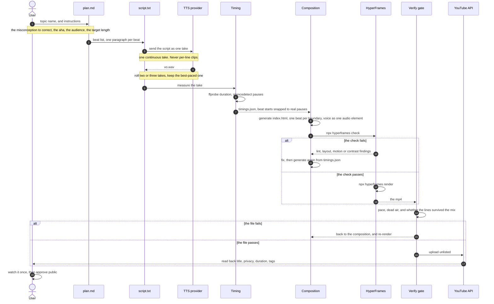

# How a piece is built

You supply a topic and instructions. The project turns them into a plan, a script, one voice take, a
composition, a rendered file, and an upload. Two gates can send the work back a step. Nothing moves forward
until the gate passes.

## The sequence

## What you supply, and what gets created

| You supply | The project creates |
|---|---|
| A topic name | `plan.md`: the beats, written before any code |
| Instructions: the misconception, the aha, the audience, the target length | `script.txt`: one paragraph per beat |
| A TTS provider and a key | `vo.wav`, one continuous take, and `timings.json` |
| A renderer on Node | `index.html`: one beat per measured boundary |
| - | the mp4, the thumbnail, and the upload |

## The two gates

| Gate | Command | It fails on |
|---|---|---|
| Check, before rendering | `npx hyperframes check` | lint findings, layout overlap, motion errors, contrast below the threshold |
| Verify, on the rendered file | `python3 tools/verify.py out.mp4 <duration> "<first line>" "<last line>"` | wrong pace, dead air, or a line that did not survive the mix |

Both gates loop back to the composition, not forward to the upload. A project can pass its own check and the
file still be wrong, which is why the second gate reads the mp4 and not the project.

The same diagram is rendered on a dark background in `how-a-piece-is-built.png`, for slides or a video frame.
It is the only image in this repository.

## Where it stops

The pipeline never publishes by itself. The upload is unlisted, and a person watches the file and approves
public. The read-back line is the only proof of what YouTube stored: title, privacy, duration and tags,
read from the API, not from the uploader's success message.
